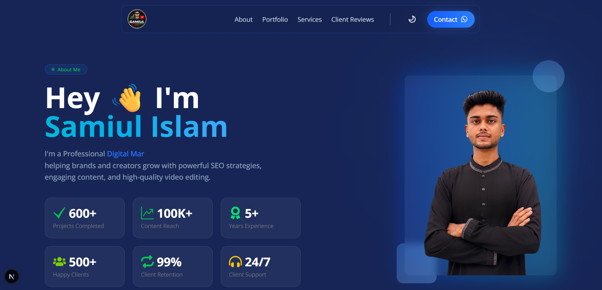

## 📸 Preview



# Samiul TubeGrowth Studio

A modern and fully responsive personal portfolio website built with Next.js, showcasing professional services, portfolio projects, client reviews, and an admin dashboard for content management.

## 🚀 Live Features

### Public Website

- Modern Responsive Design
- Dark / Light Mode
- Animated Hero Section
- About Me Section
- Services Showcase
- Portfolio Gallery
- Portfolio Filtering
- Portfolio Modal Preview
- Client Reviews Slider
- Pricing Section
- Contact Section
- WhatsApp Integration
- Professional Footer

### Admin Dashboard

- Secure Authentication
- Add Portfolio
- Edit Portfolio
- Delete Portfolio
- Manage Client Reviews
- Responsive Dashboard Layout
- Protected Routes

---

## 🛠️ Technologies Used

### Frontend

- Next.js 16
- React 19
- Tailwind CSS 4
- Framer Motion
- Swiper.js
- HeroUI
- Next Themes

### Backend

- Better Auth
- MongoDB
- MongoDB Adapter

### UI Libraries

- React Icons
- Lucide React
- Gravity UI Icons
- React Hot Toast

---

## 📦 Installation

Clone the repository:

```bash
git clone https://github.com/tawhidzihad/samiul-portfolio-client.git
```

Navigate to the project directory:

```bash
cd samiul-portfolio-client
```

Install dependencies:

```bash
npm install
```

Create a `.env.local` file in the root directory and add the following variables:

```env
BETTER_AUTH_SECRET=your_secret_key

BETTER_AUTH_URL=http://localhost:3000

NEXT_PUBLIC_BASE_URL=http://localhost:3000

MONGO_DB_URI=your_mongodb_connection_string

NEXT_PUBLIC_API_URL=http://localhost:3000/api
```

Start the development server:

```bash
npm run dev
```

Open:

```txt
http://localhost:3000
```

---

## 🔑 Environment Variables

| Variable             | Description            |
| -------------------- | ---------------------- |
| BETTER_AUTH_SECRET   | Better Auth Secret Key |
| BETTER_AUTH_URL      | Better Auth Base URL   |
| NEXT_PUBLIC_BASE_URL | Frontend Base URL      |
| MONGO_DB_URI         | MongoDB Database URI   |
| NEXT_PUBLIC_API_URL  | API Base URL           |

---

## 📂 Project Structure

```txt
src
│
├── app
│   ├── dashboard
│   ├── portfolio
│   ├── login
│   ├── signup
│
├── components
│   ├── Navbar
│   ├── Footer
│   ├── Portfolio
│   ├── Services
│   ├── Testimonials
│
├── lib
│
├── hooks
│
├── providers
│
└── utils
```

---

## 📜 Available Scripts

### Development

```bash
npm run dev
```

### Production Build

```bash
npm run build
```

### Start Production Server

```bash
npm run start
```

### Run ESLint

```bash
npm run lint
```

---

## 📦 Dependencies

### Main Dependencies

- @better-auth/mongo-adapter
- @heroui/react
- @heroui/styles
- better-auth
- framer-motion
- lucide-react
- mongodb
- next
- next-themes
- react
- react-dom
- react-hot-toast
- react-icons
- react-type-animation
- swiper

### Development Dependencies

- @gravity-ui/icons
- @tailwindcss/postcss
- eslint
- eslint-config-next
- tailwindcss

---

## 🎯 Key Features

### Portfolio Management

- Add Portfolio
- Edit Portfolio
- Delete Portfolio
- Category Filtering
- Image Preview

### Client Reviews Management

- Add Review
- Edit Review
- Delete Review
- Dynamic Review Slider

### Authentication

- Better Auth Integration
- Secure Login
- Secure Registration
- Protected Dashboard Routes

### User Experience

- Responsive Design
- Smooth Animations
- Dark/Light Theme
- Mobile Friendly Layout

---

## Server Side Repo: https://github.com/tawhidzihad/samiul-portfolio-server

## 📄 License

This project is intended for personal and portfolio use.
